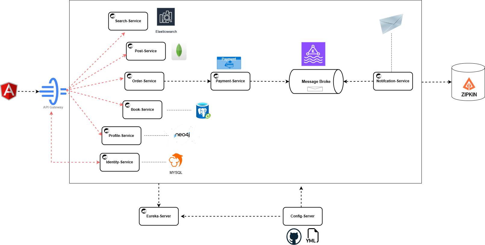

# Book Store System

Chào mừng bạn đến với hệ thống **Bookstore**! Đây là dự án xây dựng nền tảng bán sách trực tuyến 
với nhiều tính năng thú vị như tìm kiếm sách, quản lý giỏ hàng, thanh toán, và phân tích hành vi người dùng.

## Mục Lục
1. [Giới thiệu](#giới-thiệu)
2. [Cài đặt](#cài-đặt)
3. [Cấu Trúc Dự Án](#cấu-trúc-dự-án)
4. [Các Tính Năng](#các-tính-năng)
5. [Sơ Đồ Hệ Thống](#sơ-đồ-hệ-thống)
6. [Hướng Dẫn Sử Dụng](#hướng-dẫn-sử-dụng)
7. [Liên Hệ](#liên-hệ)

## Giới Thiệu

Hệ thống **Bookstore** là một nền tảng mua bán sách trực tuyến. Dự án này cung cấp khả năng tìm kiếm sách, 
thêm sách vào giỏ hàng, thanh toán, và nhiều tính năng hữu ích khác để phát triển nền tảng này.
Chúng tôi sử dụng các công nghệ:
    - BACKEND: **Spring Boot**, **Kafka**, **RabbitMQ**, **Redis**, **Elasticsearch**, **Kibana** 
    - FRONTEND: **Angular**
    - DATABASE: **Mysql**, **Postgres**, **MongoDb**, **Neo4j**
    - CACHE: **Redis**
    - DISTRIBUTED TRACING: **Zipkin**

## Cài Đặt
./docker-compose.yml

### Yêu Cầu
- Java 21 
- Maven 3.9.8
- Docker 
- Spring Boot 3.x

### Các Bước Cài Đặt
1. Clone repository
    - git clone https://github.com/lekhanhduc/Microservies2025
    - branch: master

2. Chạy các dịch vụ
    - Sử dụng Docker Compose để khởi động các dịch vụ Kafka, RabbitMQ, Zipkin, MongoDb, MySQL, ElasticSearch, Kibana, Neo4j

3. Chạy ứng dụng Spring Boot:
    -  ./mvnw spring-boot:run

## Cấu Trúc Dự Án
spring-microservices-21.01.2025/
├── ApiGateway/
├── BookService/
├── ConfigServer/
├── IdentityService/
├── NotificationService/
├── OrderService/
├── PaymentService/
├── PostService/
├── ProfileService/
├── RegistryService/
├── SearchService/
├── docker-compose.yml
├── init.sql
└── README.md

## Các Tính Năng
Hệ thống **Bookstore** cung cấp các tính năng mạnh mẽ cho người dùng và quản trị viên. Các tính năng chính bao gồm:

- **Tìm kiếm sách**: Người dùng có thể tìm kiếm các cuốn sách theo tên, tác giả, thể loại, giá cả, v.v.
- **Thanh toán trực tuyến**: Hệ thống hỗ trợ nhiều phương thức thanh toán, bao gồm thẻ tín dụng, ví điện tử, và thanh toán khi nhận hàng.
- **Đánh giá và nhận xét**: Người dùng có thể đánh giá và để lại nhận xét về các cuốn sách.
- **Khuyến mãi và mã giảm giá**: Hệ thống hỗ trợ mã giảm giá, khuyến mãi đặc biệt cho khách hàng khi mua sắm.
- **Phân tích hành vi người dùng**: Thu thập và phân tích dữ liệu về hành vi người dùng (như các cuốn sách được xem, các từ khóa tìm kiếm phổ biến) để tối ưu hóa trải nghiệm người dùng.
- **Quản lý người dùng**: Quản lý thông tin người dùng và bảo mật với tính năng xác thực và phân quyền.
- **Hệ thống gợi ý sách**: Hệ thống sẽ gợi ý sách dựa trên sở thích và lịch sử mua hàng của người dùng.

## Sơ Đồ Hệ Thống

Dưới đây là sơ đồ mô tả kiến trúc của hệ thống **Bookstore**. Nó bao gồm các microservices và cách chúng giao tiếp với nhau qua **Kafka**, **RabbitMQ**, **Redis**, và các dịch vụ khác.

- **ApiGateway**: Là điểm vào duy nhất của hệ thống, tiếp nhận tất cả các yêu cầu từ người dùng và chuyển đến các dịch vụ tương ứng.
- **BookService**: Cung cấp các tính năng quản lý sách, bao gồm thêm sách, chỉnh sửa sách, tìm kiếm sách.
- **OrderService**: Quản lý đơn hàng của khách hàng, bao gồm tạo đơn hàng, theo dõi trạng thái đơn hàng.
- **PaymentService**: Quản lý các giao dịch thanh toán của người dùng.
- **IdentityService**: Xử lý xác thực người dùng và phân quyền.
- **SearchService**: Cung cấp tính năng tìm kiếm sách với hỗ trợ Elasticsearch.
- **NotificationService**: Gửi thông báo cho người dùng về trạng thái đơn hàng hoặc các sự kiện quan trọng.
- **ConfigServer**: Quản lý cấu hình tập trung cho toàn bộ hệ thống.
- **RegistryService**: Đảm bảo việc tự động phát hiện và đăng ký các dịch vụ trong hệ thống.

## Hướng Dẫn Sử Dụng

## Liên Hệ
Nếu bạn gặp vấn đề trong quá trình cài đặt hoặc sử dụng ứng dụng, vui lòng liên hệ với chúng tôi qua các phương thức dưới đây:

- **Email**: lekhanhduccc@gmail.com
Cảm ơn bạn đã sử dụng hệ thống **Bookstore**. Chúng tôi luôn sẵn sàng hỗ trợ và cải thiện để mang đến cho bạn trải nghiệm tốt nhất!